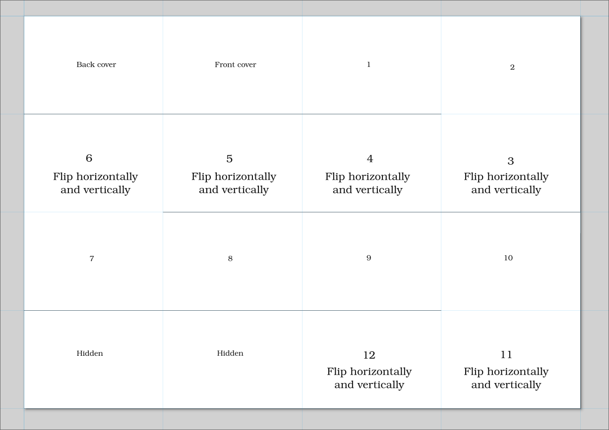
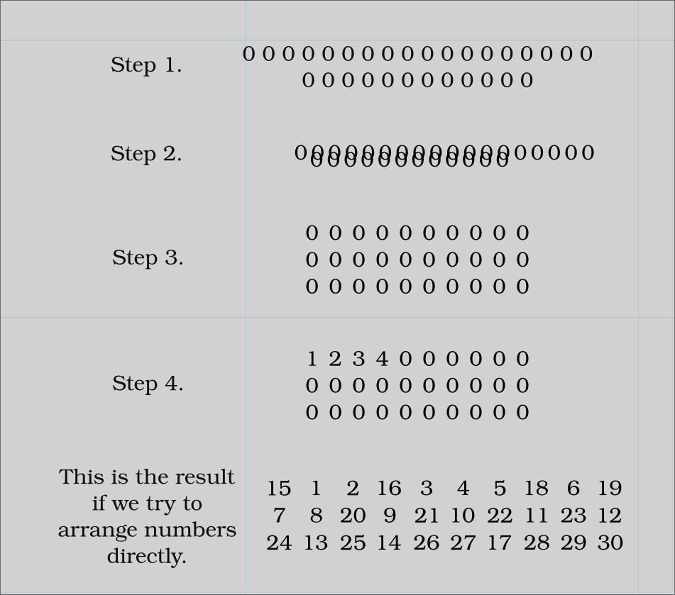

One of the advantages of playing Dungeons & Dragons in person is being able to craft handouts for your players. Hand-drawn maps, letters from NPCs with wax seals, even terrain and minis all play in to the wonder of the game.

[Zines](https://en.wikipedia.org/wiki/Zine) are another form of handout with distinct advantages; you can cram a bunch of information in them in palatable portions, style it with pictures and colors to your liking, and allow your players to make personal notes on it. Various tutorials for different types of zines are readily available on google, so try them out!

# The Calendar of Harptos

The Forgotten Realms setting uses a modified, stripped version of the Gregorian calendar, called the [Calendar of Harptos.](https://forgottenrealms.fandom.com/wiki/Calendar_of_Harptos)
Holidays are rare, and marked events occur on special days between months. For example, the Greengrass festival is held between Tarsakh 30th and Mirtul 1st. One would be tempted to call this event Tarsakh 31st, but to the (imaginary) locals the day of Greengrass exists outside the scope of the month. A week is called a 'tenday', and each day of the week has a unique name associated with it. Three tendays to a month, twelve months to a year. Easy, right?

| Concept |  Length   |
| :-----: | :-------: |
|  Year   | 12 Months |
|  Month  |  3 Weeks  |
|  Week   |  10 Days  |
|   Day   | 24 hours  |

<i>
Forgotten Realms timekeeping concepts.
</i>

The campaign of Icewind Dale takes place in the (imaginary) year of 1489 DR, which has been [mapped out in detail](https://forgottenrealms.fandom.com/wiki/1489_DR) by enthusiastic fans of the setting. Asking my players to remember all this detail would be too much! Thankfully other dungeonmasters have run into similar issues, and have developed their own methods of sharing this information without overloading the players. I'm attempting the same with topic of this blog post, a zine calendar.

I've copied the outline for my calendar from reddit user [u/ogmha-the-binder's post](https://www.reddit.com/r/rimeofthefrostmaiden/comments/lpboob/calendar_of_icewind_dale/) related to the campaign. Thanks Ogmha!

# The zine template

I'm using [Inkscape](https://inkscape.org/) for creating my template. It's free and is pretty easy to pickup, I highly recommend you try it.

We begin by creating A3 size document on inkscape. If you have no access to A3, A4 pages are suitable too, however the end result will be half the size of the examples in this post. Consider the amount of information you wish to display; you may have to sacrifice density for readability.

Select **File > Document properties** and select your page size and suitable orientation. Take note of the height and width, for example an A3 sheet is 297x420 mm.

Switch to the **Grids** tab and input the width and height divided by 4 into **Spacing X/Y**. You can use mathematical expressions, such as 420/4 to calculate the value directly.

<i>
Example of A3 size document properties and grid.
</i>

The resulting 4x4 grid is sufficient for a 12 page zine, with a few pages left over. You can use these for whatever you wish, but I will be hiding them by glueing them behind the front and back covers to create a stronger spine for the zine.

To visualize the layout of the pages, I've included a screenshot of a blank page with labels attached to each square. The dark lines indicate where to cut, and blue lines indicate a fold. Note that every other row is flipped both vertically and horizontally!

<i>
Zine layout with labels.
</i>

# Creating the calendar

At this point you should know what your typical fantasy month looks like. I recommend adding consistent events, such as phases of the moon or weekend markers early, as you will be copy-pasting the same template over and over.

Select a suitable font and create a text box containing a "0" for each of the days of the month. Select the result and select **Extensions > Text > Split text** to create a unique "0" for each day. The result will look like a massive scramble, but don't worry, we will construct an array out of them.

Select the words, then select **Object > Align and distribute** and under the **Grid** tab, play around with the rows and columns until you are happy with the result.

Due to the internal workings of Inkscape, splitting text scrambles the order of the resulting labels. This is why we must manually change the "0" labels to the correct numbers afterward. There may be a better way of doing this, but I couldn't find it in less time than it took to create the array.

<i>
Example steps for creating the day grid.
</i>

Styling your month is up to you. I've opted for a simple, black and white calendar with with short explanations for the big holidays of the year. I added small icons to indicate the current phase of the moon, and highlighted special days in gray. Most of the work is copy pasting the template, flipping it appropriately, and changing the details afterward.

<i>
I've copied u/ogmha-the-binder's minimalist design for my calendar.
</i>

Feel free to modify each month as you see fit. Just because Forgotten Realms has convenient, equally long months doesn't mean yours should!

# Printing and assembly

I printed my calendar on a single A3 sheet. You can include the 'cut-here' lines on your template as guides, but I've chosen to drop them from mine. In order to assemble your zine, you are going to need scissors and glue.

 
<i>
The printed page without any creases.
</i>

Start by folding the page in half length-wise, then fold the halves in half, creating a grid of 4 equal rows. Next, fold the page in half width-wise. Again, fold the halves in half, creating a grid of squares.

<i>
Folding in halves will result in a 4x4 grid.
</i>

If your design is properly measured, these squares should line up with your pages. Don't worry if the creases are a little off, just focus on getting the shapes about where you want them.

Once your grid is properly aligned, start by cutting the first row 3/4ths of the way open. Repeat this step in reverse for the middle row, and finally cut the last row similarly to the first. You should end up with a zig-zag pattern of squares.

Start folding the pages together on the connected edge. Follow the creases and flip the page over when the row ends. You should end up with a unbound zine, with the back and front covers open. Slide the unused pages behind the back and front covers and inspect your work. This is the moment to make adjustments if needed!

<i>
The result after cutting and folding along the seams.
</i>

Once you are satisfied with the result, beging glueing the pages together. Start from the first month and work your way through the entire zine, glueing the back and front covers last. Finish the zine by trimming the excess paper on the outer edges. Congratulations, the zine is complete!

<i>
So quick and easy, I did it twice!
</i>

# Conclusion

I started this project with the intention of creating fun little handout calendars for my players in preparation for my next D&D campaign. I'm very happy with the results, with the added bonus of my new zine-making skills to boot! These things feel very personal and somehow valuable. Propably because I made them, but still! I hope my players will enjoy them, and I hope you learned something from this impromptu guide too.

Making zines is fun. Maybe I will convert this blog post into a zine itself and call it my analog blog.

Happy holidays!

-- Janne
